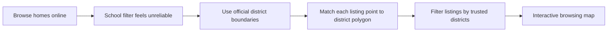
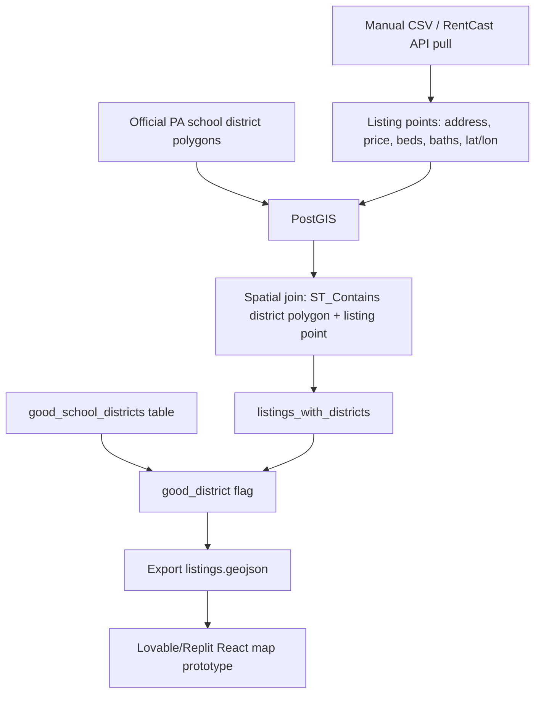
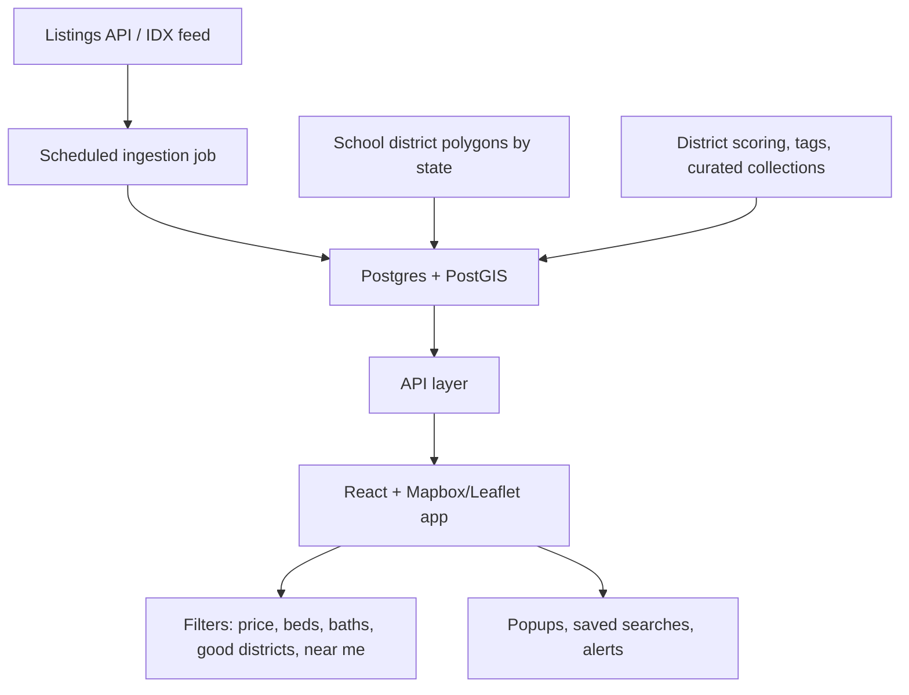

# Architecture Notes

## 1. Problem → Solution Flow



## 2. Current Prototype Architecture



## 3. Future Scalable Architecture



## Product framing

The core differentiator is not generic listing search; it is a verified district intelligence layer:

```text
Listings are commodity data.
District intelligence is the product layer.
```
