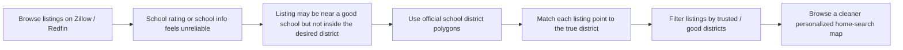
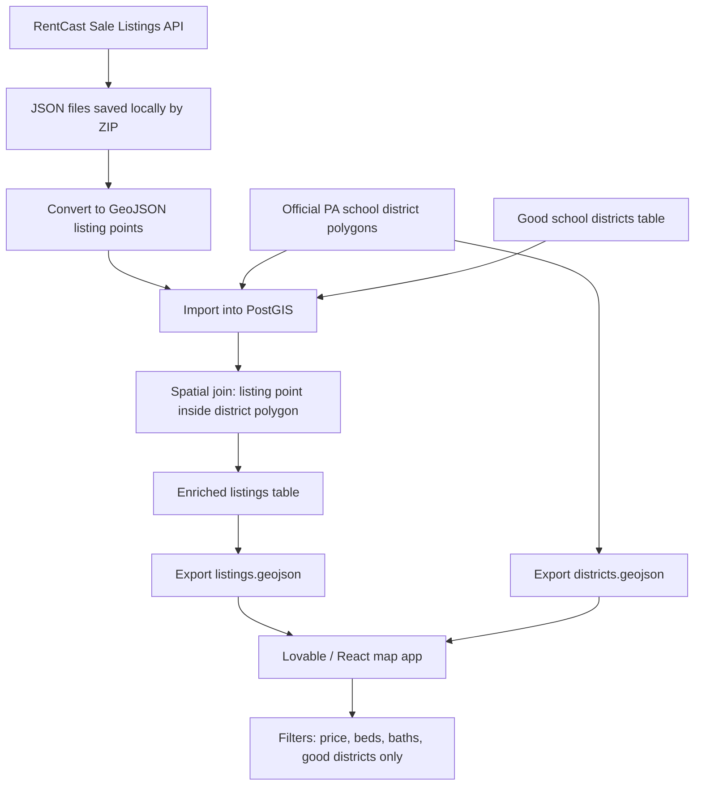
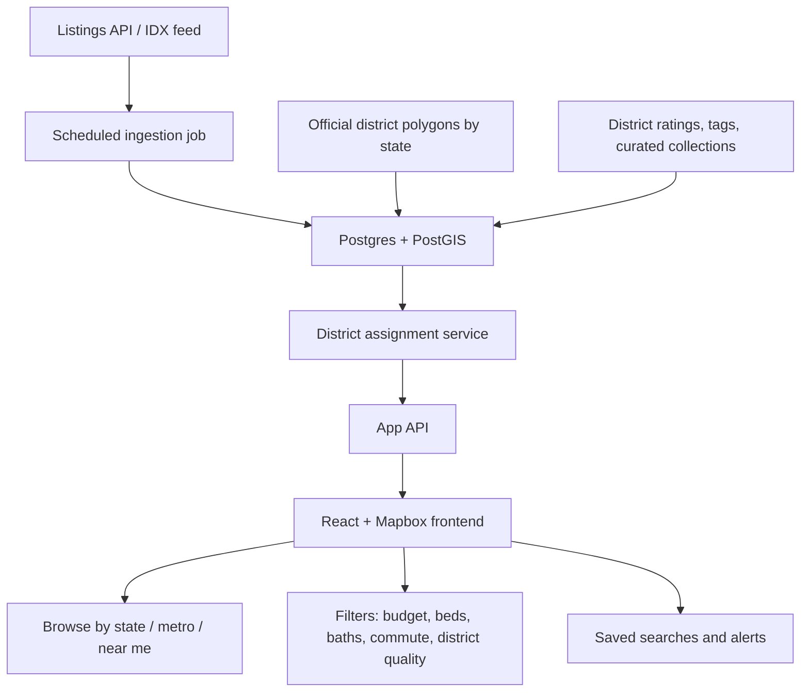
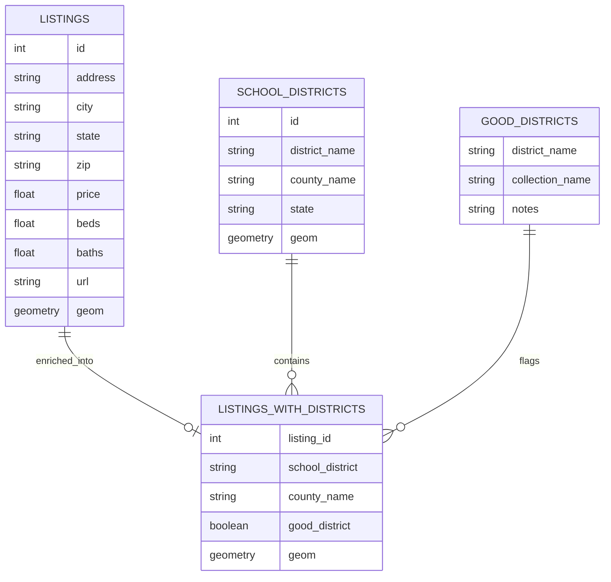
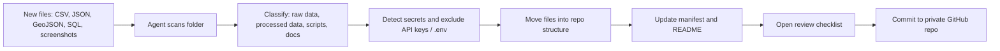

# School District Home Search — Diagrams

## 1. Problem → Solution Flow

## 2. Current Prototype Architecture

## 3. Future Scalable Architecture

## 4. Data Model

## 5. Agentic Cleanup Workflow

